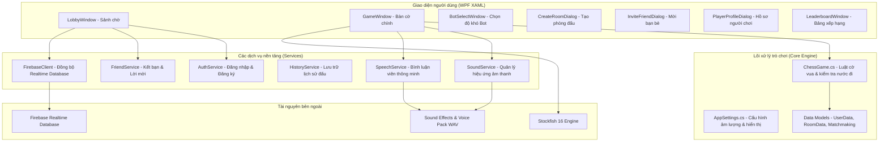

# ♟️ Cờ Vua VIP Pro (Chess Game PJ)

[](https://dotnet.microsoft.com/)
[](https://www.microsoft.com/windows)
[](https://learn.microsoft.com/en-us/dotnet/desktop/wpf/)
[](https://stockfishchess.org/)
[](https://firebase.google.com/)

Game Cờ Vua hiện đại trên nền tảng **Windows Desktop** được phát triển bằng **C# / .NET 10** và giao diện **WPF (XAML)** phong cách Dark Esports / Sci-Fi. Ứng dụng tích hợp công cụ AI **Stockfish**, hệ thống bình luận viên giọng nói thông minh, chế độ chơi Online qua **Firebase Realtime Database**, tính điểm **ELO**, hệ thống bạn bè và bảng xếp hạng trực tuyến.

Toàn bộ trò chơi được đóng gói thành một file **Single-File Executable (`Cờ vua vip pro.exe`) duy nhất** (~240MB, tự chứa .NET Runtime, Stockfish Engine, video nền, âm thanh và voice pack), tải về là có thể chơi ngay lập tức không cần cài đặt thêm bất kỳ phần mềm nào.

---

## 🎮 Tải về & Chơi ngay

Bạn có thể tải trực tiếp file game tại thư mục gốc của repository:
👉 **[`Cờ vua vip pro.exe`](https://github.com/Long9boy/ChessGame/raw/main/C%E1%BB%9D%20vua%20vip%20pro.exe)**

> [!TIP]
> Tải file về máy Windows 10/11 (64-bit), nhấp đúp để mở và chơi ngay! Không yêu cầu cài đặt .NET SDK hay runtime bên ngoài.

---

## ✨ Tính năng nổi bật

### 1. ♟️ Luật cờ vua quốc tế chuẩn xác 100%
- Tự phát triển engine kiểm tra tính hợp lệ của mọi nước đi (Tốt, Mã, Tượng, Xe, Hậu, Vua).
- **Chiếu & Chiếu bí (Check & Checkmate)**: Đánh dấu đỏ vị trí Vua bị chiếu, tự động khóa bàn cờ khi chiếu bí hoặc hòa cờ.
- **Nhập thành (Castling)**: Hỗ trợ cả nhập thành gần (O-O) và nhập thành xa (O-O-O) với đầy đủ điều kiện (chưa di chuyển, các ô không bị kiểm soát, không có quân cản).
- **Phong cấp tốt (Pawn Promotion)**: Hộp thoại trực quan cho phép chọn nâng cấp lên Hậu, Xe, Tượng hoặc Mã.
- Ngăn chặn triệt để mọi nước đi khiến Vua của mình bị chiếu (tự chiếu).

### 2. 🤖 Chế độ chơi đa dạng
- **Chơi Offline với AI (Stockfish)**:
  - Tích hợp engine cờ vua mạnh nhất thế giới **Stockfish 16**.
  - Nhiều cấp độ độ khó từ cơ bản đến kiện tướng (Tập sự, Nghiệp dư, Chuyên nghiệp, Đại kiện tướng, Siêu trí tuệ).
  - Có thể chọn cầm quân Trắng hoặc quân Đen, hỗ trợ lật bàn cờ linh hoạt.
- **Tìm trận nhanh (Matchmaking)**:
  - Hệ thống ghép cặp tự động dựa trên ELO tương đồng giữa các người chơi trực tuyến.
- **Tạo phòng & Tham gia phòng (Custom Room)**:
  - Tạo phòng với mã số 6 chữ số ngẫu nhiên.
  - Tùy chỉnh thời gian thi đấu mỗi lượt (1 phút, 3 phút, 5 phút, 10 phút, 15 phút).
  - Tùy chọn đấu thường (Casual) hoặc đấu xếp hạng (Ranked - tính điểm ELO).
  - Mời bạn bè trực tiếp từ sảnh chờ vào phòng đấu.

### 3. 🎙️ Bình luận viên giọng nói (Voice Pack Commentary)
- Bình luận viên tiếng Việt tự động phản ứng theo từng diễn biến trận đấu theo thời gian thực:
  - Nhắc nhở nguyên tắc khai cuộc (Ruy Lopez, Italian Game, phát triển quân nhẹ, cảnh báo xuất Hậu sớm).
  - Cảm thán nước đi sai lầm nghiêm trọng (Blunder), bỏ lỡ cơ hội chiếu bí (Missed Mate).
  - Bình luận khi ăn quân giá trị cao (Hậu, Xe, Tượng, Mã).
  - Cảnh báo khi thời gian thi đấu sắp hết.

### 4. 👥 Hệ thống tài khoản, Xếp hạng & Bạn bè
- **Đăng ký / Đăng nhập** nhanh chóng, lưu trữ hồ sơ người chơi an toàn.
- **Điểm số ELO**: Cập nhật tăng/giảm ELO chuẩn quốc tế sau mỗi trận đấu Ranked.
- **Bảng xếp hạng (Leaderboard)**: Vinh danh Top người chơi có điểm ELO cao nhất toàn server.
- **Hệ thống bạn bè**:
  - Tìm kiếm và kết bạn qua tên người chơi (Username).
  - Hiển thị trạng thái Online / In-Game theo thời gian thực.
  - Thông báo huy hiệu số lời mời kết bạn đang chờ xét duyệt.
  - Mời bạn bè vào phòng thi đấu bằng 1 cú click.

### 5. 📜 Lịch sử đấu & Xem lại trận đấu (Replay System)
- Ghi lại toàn bộ biên bản ván đấu theo ký hiệu chuẩn quốc tế (Algebraic Notation).
- Bộ điều khiển phát lại trận đấu thông minh: **Lùi 1 nước**, **Tiến 1 nước**, **Tự động chạy (Play)**, **Tạm dừng (Pause)**.

### 6. 🎨 Giao diện WPF hiện đại & Hiệu ứng đỉnh cao
- Giao diện Dark Sci-Fi thiết kế tỉ mỉ, bo góc hiện đại.
- Video nền hoạt cảnh sảnh chờ (30s Seamless Loop) sống động.
- Hiệu ứng đổ bóng 3D và bừng sáng (glow) khi rê chuột vào các thẻ game, nút Cài đặt, Bạn bè, Đăng nhập/Đăng xuất.
- Âm thanh ván đấu chân thực (di chuyển quân cờ, bắt quân, chiếu tướng, nhập thành, thắng/thua).

---

## 🏗️ Kiến trúc hệ thống



---

## 📁 Cấu trúc thư mục mã nguồn

```
ChessGame/
├── Cờ vua vip pro.exe               # File chạy duy nhất (Single-file Release)
├── README.md                       # Tài liệu hướng dẫn dự án
├── .gitignore                      # Cấu hình bỏ qua file build/tạm thời
├── .gitattributes                  # Cấu hình Git LFS cho file nhị phân lớn (.exe)
└── Source Code/                    # Toàn bộ mã nguồn dự án
    ├── ChessGame PJ.slnx           # File Solution của Visual Studio
    └── ChessGame PJ/
        ├── ChessGame PJ.csproj     # File cấu hình dự án .NET 10 WPF
        ├── App.xaml / App.xaml.cs  # Điểm khởi chạy ứng dụng WPF
        ├── assets/                 # Toàn bộ tài nguyên game
        │   ├── engine/             # Stockfish 16 Engine (.exe)
        │   ├── sounds/             # Âm thanh di chuyển, cờ, voice pack
        │   ├── textures/           # Ảnh quân cờ, nút bấm, background
        │   └── videos/             # Video nền sảnh chờ (lobby_loop.mp4)
        └── src/
            ├── Core/               # Engine luật cờ, AI bot, dữ liệu cấu hình
            ├── Services/           # Dịch vụ Firebase, Auth, Friends, Audio
            └── Views/              # Toàn bộ giao diện XAML và Code-behind
```

---

## 🚀 Hướng dẫn biên dịch từ mã nguồn

### Yêu cầu hệ thống
- Hệ điều hành: **Windows 10 / 11 (64-bit)**
- **[.NET 10.0 SDK](https://dotnet.microsoft.com/download/dotnet/10.0)** (với Desktop Workload)
- **Visual Studio 2026** (hoặc mới hơn) hỗ trợ .NET 10 Desktop Development

### Các bước thực hiện

1. **Clone repository về máy:**
   ```bash
   git clone https://github.com/Long9boy/ChessGame.git
   cd ChessGame
   ```

2. **Mở dự án:**
   Mở file [`Source Code/ChessGame PJ.slnx`](Source%20Code/ChessGame%20PJ.slnx) bằng Visual Studio hoặc sử dụng lệnh:
   ```bash
   cd "Source Code"
   dotnet build "ChessGame PJ.slnx"
   ```

3. **Chạy ứng dụng chế độ Debug:**
   ```bash
   dotnet run --project "ChessGame PJ/ChessGame PJ.csproj"
   ```

4. **Xuất bản thành 1 file EXE độc lập (Self-Contained Single File):**
   ```bash
   dotnet publish "ChessGame PJ/ChessGame PJ.csproj" -c Release -r win-x64 -o "../publish"
   ```
   File `Cờ vua vip pro.exe` hoàn chỉnh sẽ được tạo trong thư mục `publish/`.

---

## 🛠️ Công nghệ sử dụng

- **Ngôn ngữ:** C# 14 / .NET 10.0
- **Giao diện:** Windows Presentation Foundation (WPF) với XAML tùy biến cao cấp
- **Âm thanh:** `NAudio 3.1.0` & `NAudio.Vorbis 3.0.0`
- **Engine cờ:** Stockfish 16 (UCI Protocol)
- **Cơ sở dữ liệu Online:** Firebase Realtime Database qua REST API
- **Quản lý file lớn:** Git Large File Storage (Git LFS)

---

## 📄 Bản quyền & Tác giả

- **Tác giả:** [Long9boy](https://github.com/Long9boy) x CNTT team (Thế Sơn - Phi Hùng)
- **Dự án:** ChessGame PJ - Cờ Vua VIP Pro
- Mọi đóng góp, báo lỗi (Issues) hoặc Pull Request đều được hoan nghênh tại [GitHub Repository](https://github.com/Long9boy/ChessGame).
